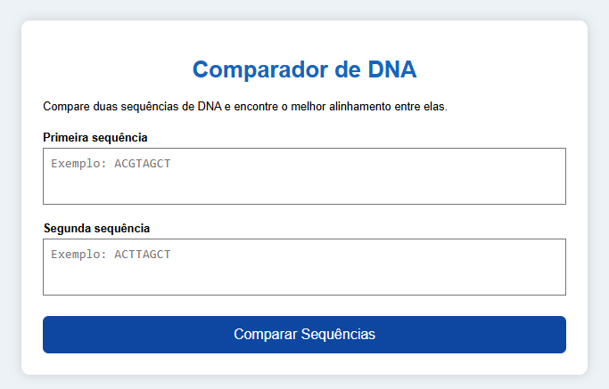
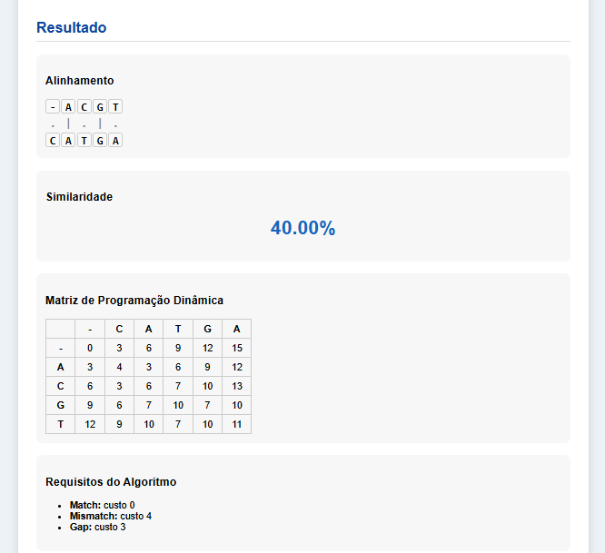

# G12_Programacao-Dinamica_PA-26.1

**Número da Lista**: 12 
**Conteúdo da Disciplina**: Alinhamento de Sequência  

## Alunos
|Matrícula | Aluno |
| -- | -- |
| 23/1037656  |  Arthur Guilherme Aquino Santos |
| 23/1026581  |  Tiago Lemes Teixeira |

## Sobre 

Este projeto implementa uma aplicação chamada Comparador de DNA, cujo objetivo é encontrar o melhor alinhamento entre duas sequências de DNA informadas pelo usuário. O sistema recebe duas sequências de nucleotídeos por meio da interface e aplica o algoritmo de Alinhamento Global de Sequências (Needleman-Wunsch) para determinar o alinhamento de menor custo entre elas.

Cada caractere das sequências representa um nucleotídeo, e o algoritmo utilizado aplica a técnica de Programação Dinâmica, construindo uma matriz que armazena o custo mínimo para alinhar todos os prefixos das sequências. Durante esse processo, são consideradas operações de correspondência (match), substituição (mismatch) e inserção de lacunas (gap), permitindo encontrar a solução ótima para o problema.

Após o processamento, o programa reconstrói o melhor alinhamento percorrendo a matriz de trás para frente e exibe o resultado ao usuário. Além do alinhamento obtido, a aplicação apresenta uma linha indicando as correspondências entre as sequências, a porcentagem de similaridade calculada automaticamente e a matriz de programação dinâmica utilizada durante a execução do algoritmo.

## Screenshots

<strong>Imagem 1: Tela Inicial</strong>

<strong>Imagem 2: Feedback do Sistema</strong>

## Instalação

**Linguagem**: HTML + CSS + JavaScript 

## Uso  

Para executar o projeto, basta abrir o arquivo principal `index.html` em qualquer navegador moderno (Chrome, Firefox, Edge, etc).

Não é necessário compilação ou instalação de dependências.

### Execução

- Abra o arquivo `index.html`
- O jogo será carregado automaticamente no navegador

### Funcionamento  

Ao iniciar o sistema, será exibida uma interface chamada **Comparador de DNA**, cujo objetivo é comparar duas sequências de DNA e encontrar o melhor alinhamento entre elas.

O usuário deve: 

- Informar a primeira sequência de DNA
- Informar a segunda sequência de DNA
- Digitar as sequências utilizando as bases nitrogenadas (A, C, G e T)
- Clicar no botão **Comparar Sequências** para iniciar a análise

Após o processamento, o sistema exibe: 

- O alinhamento entre as duas sequências 
- Uma linha indicando as posições em que houve correspondência entre as bases
- A porcentagem de similaridade entre as sequências
- A matriz de programação dinâmica utilizada pelo algoritmo - Os custos utilizados para Match, Mismatch e Gap

### Resultado da Comparação 

- **100% de similaridade** → As duas sequências são idênticas no alinhamento obtido. 
- **75% a 99%** → As sequências apresentam alta semelhança, com poucas diferenças. 
- **40% a 74%** → As sequências possuem semelhança moderada, com diferenças em várias posições. 
- **10% a 39%** → As sequências apresentam baixa similaridade. 
- **0% a 9%** → As sequências são bastante diferentes entre si.

## Gravação 

A gravação pode ser acessada através do link .
